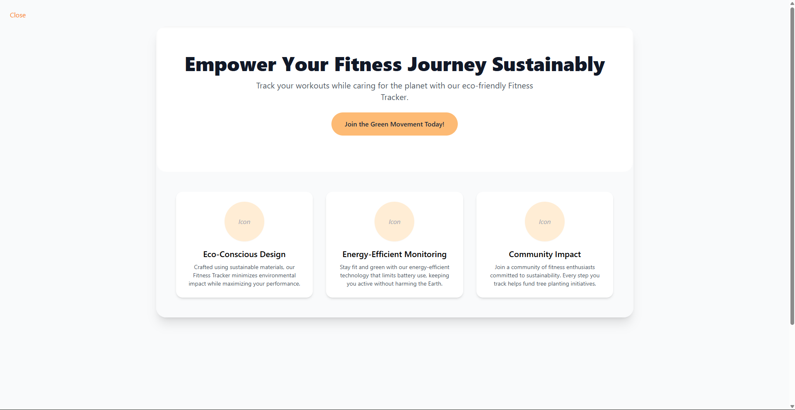
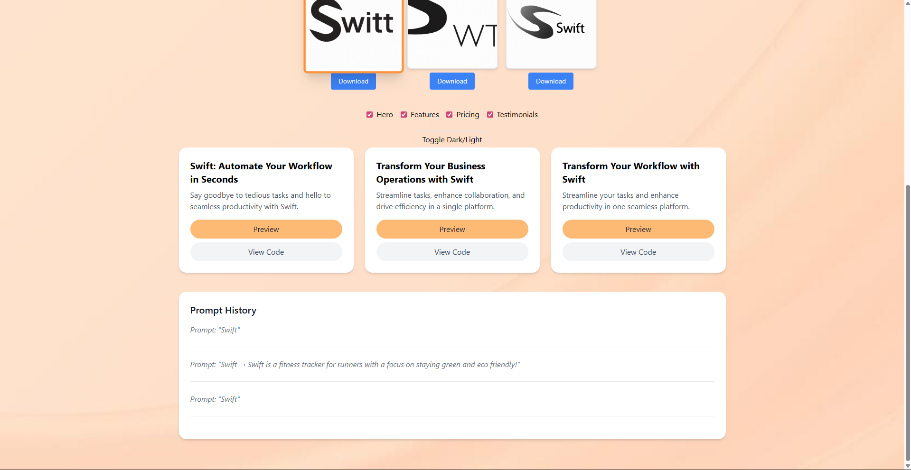
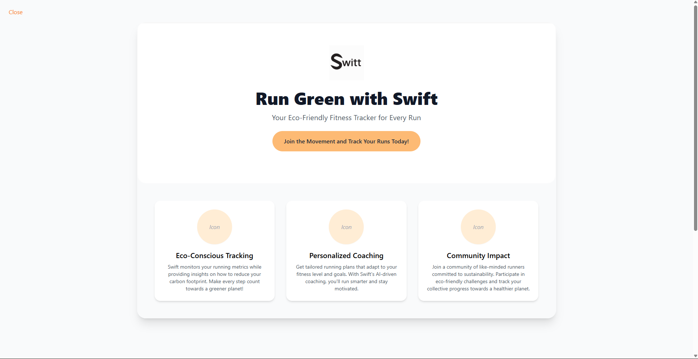
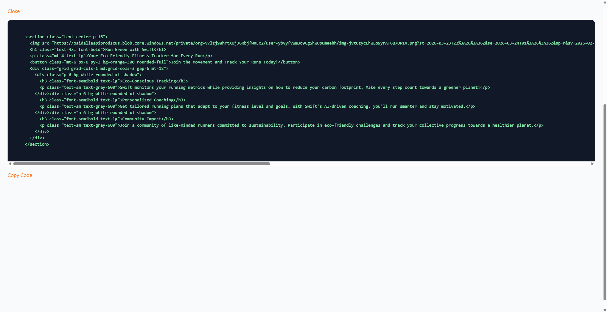

# ✨ AI Landing Page Generator

A web-based tool that generates polished SaaS landing pages instantly.

Create landing page headlines, subheadings, CTAs, and feature sections — then preview them live or copy the HTML code directly.

This project demonstrates a **modern, minimal, and professional UI** with a clean but playful peach/white theme and responsive layout.

> ⚠️ Note: this is an ongoing project!

---

## Overview

This project demonstrates a AI-native design workflow: you don’t just mock up pages — you generate them with AI, fully coded in React + Tailwind CSS. Perfect for rapid prototyping, brand exploration, or automated landing page generation.

Key highlights:

- AI-Powered Content & Visuals – Generate landing page content and multiple logo variations from a single prompt.
- Logo Selection & Download – Preview multiple logos, pick your favorite, and download it instantly.
- Live Preview & Interactivity – See your page instantly with dynamic updates and reusable components.
- Component-Based Design System – Tailwind-based buttons, cards, and forms structured for scalability.
- Rapid Iteration – Generate multiple landing pages in seconds with one input.

---

## Features

- Generate SaaS landing pages based on your idea
- Generate **multiple logos** for branding and pick your favorite
- Componentized design for fast iteration and style consistency
- Headlines, subheadings, CTAs, and feature sections
- Live preview of generated landing pages
- Export HTML code for plug-and-play use
- Prompt history to track previous ideas
- Fallback generator if AI fails  






---

## Tech Stack

**Frontend**
- React  
- Tailwind CSS  

**Backend**
- Node.js  
- Express  

**AI**
- OpenAI (GPT-4o-mini via REST API)

**Utilities**
- fetch  
- CORS  
- dotenv  

---

## ⚙️ Getting Started

### 1. Clone the repository
```bash
git clone https://github.com/aaannabelle/ai-landing-generator.git
cd ai-landing-generator
```

### 2. Install dependencies
```bash
npm install
```

### 3. Configure environment
Create a `.env` file in the root folder:

```env
OPENAI_API_KEY=your_openai_api_key
```

---

### 4. Run the backend
```bash
node index.js
```

Backend runs on:
```
http://localhost:5000
```

---

### 5. Run the frontend
```bash
npm run dev
```

Open:
```
http://localhost:5173
```

---

## Usage

1. Enter your SaaS idea
2. Click Generate to create multiple landing page variations
3. Click Generate Logos to get 3 AI-generated logos
4. Select your favorite logo by clicking it
- Optionally, download any logo using the Download button
5. Enter refinement text and click Refine to tweak your landing page
6. Click View Code to see HTML + Tailwind code
7. Copy and use the code in your own project
8. View past prompts in Prompt History 

---

## Customisation

- **Theme & colors** → Edit Tailwind classes  
- **Background image** → Replace `backgroundImage` in `App.jsx`  
- **Features** → Modify fallback or AI response structure  
- **Logo behavior** → Adjust default selection or styling in `App.jsx`

---

## Fallback Behaviour

If the AI API fails or returns invalid data, the app generates fallback content automatically.

This ensures the app **always works and never breaks**.

---

## License

MIT License — free to use, modify, and share.

---

## Next Steps

- Add custom hero images
- Add interactive micro-animations for better engagement
- Integrate real icons / illustrations
- Export React/Tailwind components
- Deploy to Vercel or Netlify
- Expand component library for a fully scalable design system

---

## Why this project?

This project focuses on the **intersection of UI/UX design and AI-assisted development**, showcasing:

- Ability to bridge AI + UX + front-end code
- Component-based UI thinking  
- Prompt-driven content generation  
- Real-world SaaS design patterns  
- Clean, responsive frontend implementation  
- Rapid prototyping skills and visual judgment
